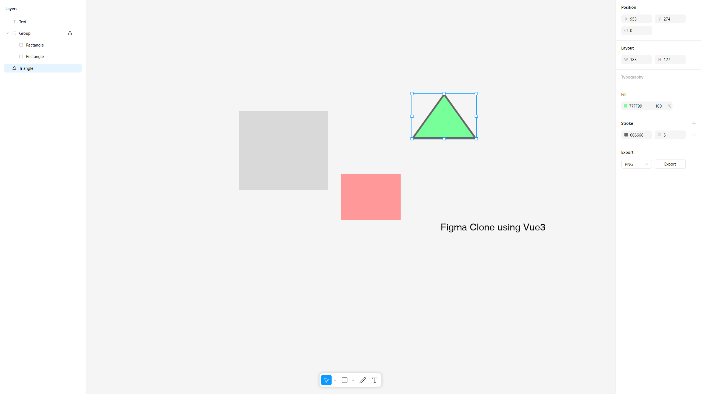

# Figma Clone using Vue3

This is a clone of the Figma website using Vue3.

### Features

- **Shape Tools**: rectangle, ellipse, line, triangle, text, and pencil.
- **Layers Management**: group, lock, delete, bring to front, and send to back.
- **Attributes Editing**: position, layout, typography, fill, stroke, and export.

### Tech Used

- **Vue3**
- **Fabric**
- **Pinia**
- **Tailwind CSS**

### Depolyment

You can try the app [Figma](https://qyunhuang.github.io/figma/). All data is stored in the browser's local storage.